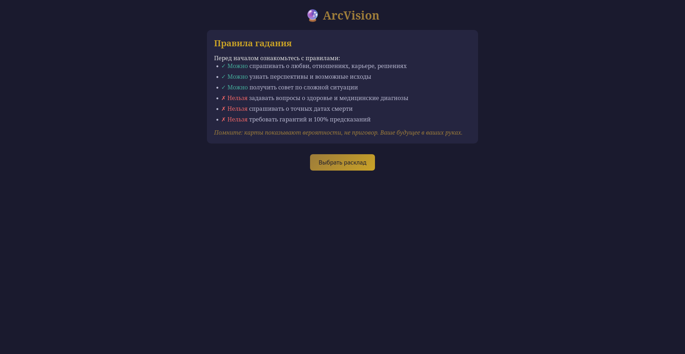
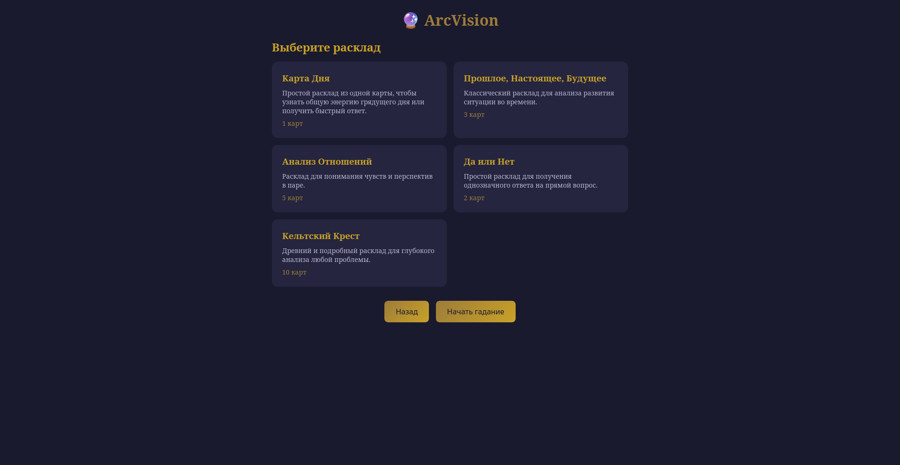
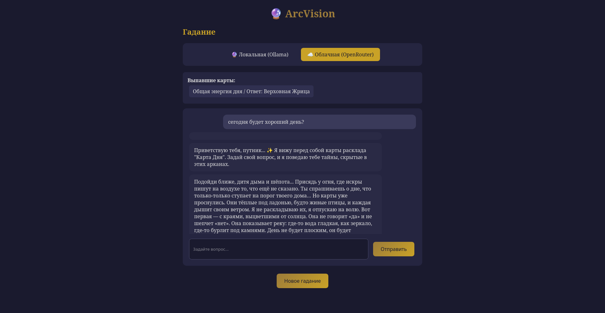

# ArcVision

API-сервис для гадания на Таро с AI-интерпретациями. Позволяет выбрать расклад, получить выпавшие карты и получить мистическую интерпретацию от языковой модели.

## Возможности

- Выбор расклада (Кельтский крест, Три карты, Да/Нет, Карта дня, Анализ отношений)
- Выбор AI-провайдера: локальный (Ollama) или облачный (OpenRouter)
- Интерактивный чат с гадалкой с поддержкой контекста
- Правила гадания с ограничениями для клиента

## Технологический стек

- **Backend:** Go 1.25
- **Frontend:** HTML/CSS/JavaScript (встроенный)
- **Локальный AI:** Ollama (модель: llama3)
- **Облачный AI:** OpenRouter (модель: qwen/qwen3.6-plus:free)
- **Конфигурация:** YAML + env

## Требования

- Go 1.25+
- Для локального AI: [Ollama](https://ollama.com)
- Для облачного AI: API ключ [OpenRouter](https://openrouter.ai)

## Быстрый старт

```bash
# Клонирование репозитория
git clone <repository-url>
cd arcvision

# Запуск сервера
go run ./cmd/server
```

Откройте http://localhost:8082 в браузере.

## Настройка AI

### Локальный (Ollama)

1. Установите Ollama: https://ollama.com
2. Запустите Ollama: `ollama serve`
3. Скачайте модель: `ollama pull llama3`
4. В конфиге установите `ai.mode: local`

### Облачный (OpenRouter)

1. Получите API ключ на https://openrouter.ai
2. Добавьте ключ в `.env`:
   ```
   AI_CLOUD_KEY=ваш_api_ключ
   ```
3. В конфиге установите `ai.mode: cloud`

## Конфигурация

Основной конфигурационный файл: `config/local.yaml`

```yaml
env: "local"

http_server:
  address: "localhost:8082"
  timeout: 60s

ai:
  mode: "cloud"  # local или cloud
  
  local:
    url: "http://localhost:11434/api/generate"
    model: "llama3"
  
  cloud:
    url: "https://openrouter.ai/api/v1/chat/completions"
    model: "qwen/qwen3.6-plus:free"
```

## API Эндпоинты

| Метод | Путь | Описание |
|-------|------|----------|
| GET | `/api/spreads` | Получить список раскладов |
| POST | `/api/reading` | Создать расклад (вытянуть карты) |
| POST | `/api/chat` | Отправить вопрос гадалке |
| GET | `/*` | Раздача статических файлов |

## Скриншоты




